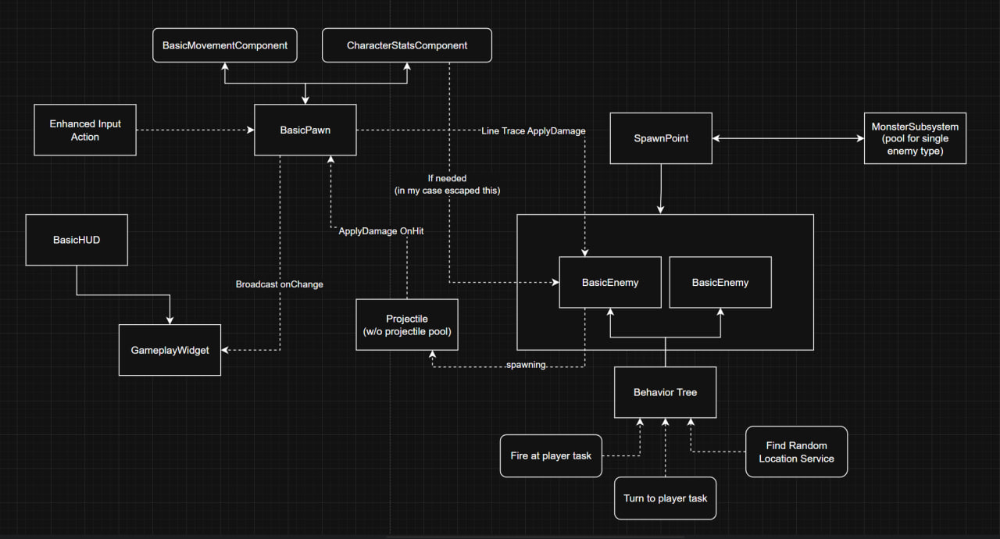

# basics_testcase

initial task: 

Everything should be implemented using the C++ Basic Code template. Engine version: 5.5. Use C++ only.

Create a basic first-person character (not from the default template);

Implement HP, MP, EXP, and LVL, and display them using widgets;

Create an area where basic enemies spawn and attack the player. The player should be able to attack enemies. Each enemy grants EXP;

On pressing key 1, trigger a skill that restores HP and consumes MP.

Creativity is welcome.

Visuals are optional — primitives are fine.

results:

https://www.youtube.com/watch?v=h7yl_4zGanM

